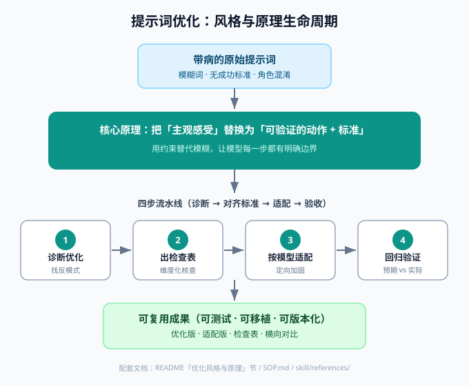
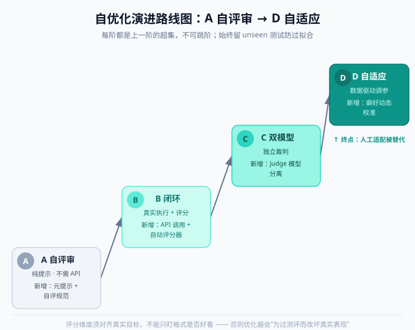

# prompt-model-adaptation

一套可复用的 **提示词优化 + 跨模型适配** 方法论，打包成开源资源，可在 WorkBuddy、Cursor、Claude Code、Codex、以及任意支持长指令的 AI 工具里使用。

核心思想：**把"主观感受词"换成"可验证的动作与标准"**，并堵住两个最容易让提示词跑偏的坑——信息不足直接生成、以及角色混淆 / 上下文泄漏；再把优化后的提示词按目标模型的家族癖好做定向适配，用 4 组回归用例验证不引入回归。

> ⚠️ 免责声明：本仓库中所有「模型家族癖好 / 预测风险」均为**经验性归纳，非基准测试**。具体版本请以你在真实模型上跑回归的「实际」结果为准；未知版本号（如 GLM5.2 / Qwen3.7 / hy3）务必标注不确定性。

---

## 目录结构

```
prompt-model-adaptation-opensource/
├── LICENSE                                # MIT 许可证文本
├── README.md                              # 本文件：中文使用说明
├── README_en.md                           # 英文使用说明
├── SOP.md                                 # 纯文本 SOP（合并 4 文件、去 frontmatter），可直贴任意 AI 工具
├── SECURITY.md                            # 安全护栏说明（Phase 0 结果）：设计 + 红队样例集
├── skill/                                 # WorkBuddy 原生 skill（带 frontmatter，给 WorkBuddy 用户）
│   ├── SKILL.md
│   ├── security/                          # 安全护栏：红队回归集（Phase 0 结果）
│   │   └── redteam-cases.md               #   14 条 / 8 类机器可读攻击样例，零容忍判定
│   ├── adaptations/                       # 跨模型适配工作区（Phase 1 结果）：gemini/claude/deepseek 隔离目录
│   │   ├── README.md                      #   工作区契约 + manifest 字段说明
│   │   ├── gemini/                        #   Gemini 适配产物（隔离）
│   │   ├── claude/                        #   Claude 适配产物（隔离）
│   │   └── deepseek/                      #   DeepSeek 适配产物（隔离）
│   └── references/
│       ├── checklist-template.md         #   可填写的 6 区块适配检查表
│       ├── regression-and-techniques.md  #   4 组回归用例 + 定向改法速查
│       ├── model-quirks.md               #   各模型家族癖好与适配要点
│       ├── eval-spec.md                  #   4 组回归用例的机器可读评测规范（A→D 闭环用）
│       ├── optimizer-meta-prompt.md      #   提示词优化器元提示（自优化闭环驱动核心）
│       ├── demo-a-tier.md                #   A 档自评审实跑演示（0/4 → 4/4 记录）
│       ├── demo-deepseek-adaptation.md   #   DeepSeek 五步法适配范例（Phase 1 范例集）
│       ├── demo-gemini-adaptation.md     #   Gemini 五步法适配范例（Phase 1 范例集）
│       ├── demo-claude-adaptation.md     #   Claude 五步法适配范例（Phase 1 范例集）
│       ├── running-real-adaptation.md    #   真机适配 API 接入 Runbook（配 key/跑 --multi/读 manifest/回校准）
│       ├── tier-tests/                   #   各档位 WorkBuddy 内实测产物（记录 + 复现 SOP）
│       │   ├── b_tier_test_record.md     #   B 档实测记录（1/4→4/4）+ 踩坑
│       │   ├── b_tier_harness.md         #   B 档复现 SOP
│       │   ├── c_tier_test_record.md     #   C 档实测记录（3/4→3/4→4/4，独立 blind 裁判）+ 诚实边界
│       │   ├── c_tier_harness.md         #   C 档复现 SOP（独立裁判模板）
│       │   ├── d_tier_test_record.md     #   D 档实测记录（2/4→3/4→4/4，失败类型驱动+检查表自填）+ 诚实边界
│       │   └── d_tier_harness.md         #   D 档复现 SOP（分类器+定向改法+检查表自填）
│       ├── 模型适配横向对比.md           #   多模型适配差异横向对比表
│       └── cross-model-adaptation-methodology.md  # 跨模型适配方法学（Phase 1 核心交付，路线 A）
├── formats/                               # 跨工具格式转换（各自独立可用）
│   ├── cursor-prompt-model-adaptation.mdc   # Cursor Rule（.mdc）
│   ├── claude-code-prompt-model-adaptation.md  # Claude Code 命令
│   └── codex-AGENTS.md                     # Codex / Agents 指引（AGENTS.md 风格）
├── tier_test_candidates/                  # B/C/D 档实测产物（候选提示词 v1/v2/v3，供复现）
│   ├── candidate_v1.md                    #   第 1 轮候选：用户原始「AI Prompt 教练」提示词
│   ├── candidate_v2.md                    #   B 档第 2 轮候选：优化器修订版
│   ├── candidate_v2_c.md                  #   C 档第 2 轮候选（澄清门，过触发）
│   ├── candidate_v3_c.md                  #   C 档第 3 轮候选（修过触发，4/4）
│   ├── candidate_v2_d.md                  #   D 档第 2 轮候选（限长+截断示例+澄清门+终止条件）
│   └── candidate_v3_d.md                  #   D 档第 3 轮候选（加待优化初版类区分，修过触发，4/4）
├── scripts/                               # B/C/D 档外部 API 闭环脚手架（本地跑，需 key）；Phase 0 护栏内置
│   ├── run_loop.py                        #   主循环：执行 → 评分 → 优化（B/C/D 档；--redteam 跑安全回归；--multi 多目标适配）
│   ├── test_phase0.py                     #   安全护栏离线自检（mock 模型，无需 key）
│   ├── .env.example                       #   API 配置模板
│   └── README.md                          #   运行说明（含 C 档双模型节）
└── assets/                                # 文档配图（PNG，GitHub/Gitee 通用渲染）
    ├── style-principle-method.svg         #   [源文件] 生命周期图（中文 SVG）
    ├── style-principle-method.png         #   生命周期图（中文 PNG，README 引用此）
    ├── style-principle-method-en.svg      #   [源文件] 同图英文版 SVG
    ├── style-principle-method-en.png      #   同图英文版 PNG
    ├── roadmap-a-to-d.svg                  #   [源文件] 路线图 A→D（中文 SVG）
    ├── roadmap-a-to-d.png                  #   路线图 A→D（中文 PNG，README 引用此）
    ├── roadmap-a-to-d-en.svg               #   [源文件] 同图英文版 SVG
    └── roadmap-a-to-d-en.png               #   同图英文版 PNG
```

---

## 工作流概览（4 步）

1. **诊断与优化**：找反模式（主观形容词、缺成功标准、角色混淆、无澄清门、无终止条件、格式不一致），给 before→after 对照并附理由。
2. **生成适配检查表**：复制检查表，填目标模型档案（名称 / 部署方式 / 温度 / 已知癖好）。
3. **适配到目标模型**：填 5 维度 + 4 组回归的*预测*风险，套用定向改法，产出「可直接复制的系统提示词 + 部署须知」。未知版本号须标注不确定性。
4. **回归验证**：在真实模型上跑 4 组用例，填「实际」列。漂移则回改法表补刀。4/4 通过 + 偏差清零即达标。

---

## 优化风格与原理



### 风格：工程化、结构化、可复现（不是"措辞玄学"）

| 风格特征 | 具体表现 |
|---|---|
| 诊断驱动 | 不急着写，先找反模式、打风险等级（高/中/低），再动手 |
| 对照式交付 | 每条改动都是 `改动前 → 改动后 + 理由`，不是只甩一个成品 |
| 以"可验证"为唯一标尺 | 每条建议都能回答"怎么算做对了"，而非"感觉更好了" |
| 版本化、防漂移 | 每个模型一份适配版，互不覆盖，方便横向对比 |
| 诚实标注 | 预测风险明确写"未实测"，不把经验当结论 |

### 原理：用可验证约束替代主观感受

**核心原理只有一条：把「主观感受」换成「可验证的动作 + 标准」。**

原始提示词的问题几乎都源于"靠模型自由发挥"——形容词无锚点、成功标准缺失、角色边界模糊。优化的本质就是**用约束替代模糊**，让模型每一步都有明确边界。围绕这条核心，派生出 6 条可操作原理：

1. **模糊 → 可验证（核心）**：「更好」→ 5 条可勾选自检清单；「谐趣」→ 1–2 句 + 明确询问。每个形容词都要有对应动作。
2. **角色与上下文隔离**：消除"双初始化"歧义（生成提示词内的角色 vs 教练自身），切断角色混淆与上下文泄漏——这是稳定性最大的隐患。
3. **澄清门 + 终止条件**：信息不足先问 ≤3 个问题再生成（防跑偏）；用户满意即定稿（防无限循环）。把开环变成有进出口的闭环。
4. **模型差异维度化**：把"哪个模型表现差"拆成 5 个可测维度——指令遵循 / 结构化敏感度 / 角色保持 / 输出长度 / 中文语感，再映射到定向改法（否定→必须式、XML 包裹、限长、few-shot、预填充）。
5. **回归验收闭环**：4 组用例跑「预期 vs 实际」，偏差清零才算完成。让"优化"从艺术变成可验收的工程。
6. **经验诚实化**：模型癖好是公开经验归纳，不是基准测试——所以检查表留"实际"空白待你实测，避免误导。

> 一句话总结：**风格 = 系统化的「诊断 → 对齐标准 → 适配 → 验收」流水线；原理 = 用可验证约束替代主观感受，并针对模型族弱点做定向加固。** 它不追求"一句话让 AI 质变"的神话，而是把提示词当作可测试、可移植、可版本化的工程产物来对待。

---

## 用法一：WorkBuddy（原生 skill）

把 `skill/` 目录整体复制到你的用户级 skills 目录：

```bash
# 复制后路径应为：
#   ~/.workbuddy/skills/prompt-model-adaptation/SKILL.md
#   ~/.workbuddy/skills/prompt-model-adaptation/references/*.md
cp -r skill ~/.workbuddy/skills/prompt-model-adaptation
```

之后在任意对话中说：
- 「优化这段提示词」→ 触发 Step 1
- 「适配成 DeepSeek / GLM / Qwen / 混元」→ 触发 Step 2–3
- 「给我个模型适配检查表」→ 触发 Step 2
- 「校验这个提示词稳不稳」→ 触发 Step 4

也可手动输入 `/prompt-model-adaptation` 或「用 prompt-model-adaptation skill 看这段」。

---

## 用法二：任意 AI 工具（纯文本 SOP）

直接把 `SOP.md` 全文复制粘贴进对话 / 项目说明 / 知识库，当作一份 SOP 文档投喂即可。任何支持长指令的 agent（Claude / GPT / 通义 / 豆包 …）都能照做。

---

## 用法三：Cursor

把 `formats/cursor-prompt-model-adaptation.mdc` 放到项目（或用户级）的 Cursor rules 目录：

```bash
# 项目级
mkdir -p .cursor/rules && cp formats/cursor-prompt-model-adaptation.mdc .cursor/rules/

# 用户级（全局）
# macOS/Linux: ~/.cursor/rules/
# Windows:     %USERPROFILE%\.cursor\rules\
```

规则带 `description` + `globs`，Cursor 会在涉及 `*.prompt.md` / `prompts/**` / `*system*prompt*` 等文件或相相关对话时自动匹配；也可在设置里手动启用。

---

## 用法四：Claude Code

把 `formats/claude-code-prompt-model-adaptation.md` 放到 Claude Code 的命令目录（文件名即命令名）：

```bash
# 项目级
mkdir -p .claude/commands && cp formats/claude-code-prompt-model-adaptation.md .claude/commands/prompt-model-adaptation.md

# 用户级（全局）
# ~/.claude/commands/prompt-model-adaptation.md
```

之后在 Claude Code 里输入：

```
/prompt-model-adaptation <这里贴你要优化/适配的提示词>
```

命令文件内含 `$ARGUMENTS` 占位，会自动接收你贴入的提示词并按工作流处理。

---

## 用法五：Codex / 通用 Agents

把 `formats/codex-AGENTS.md` 放到仓库根目录（或重命名为 `AGENTS.md`）：

```bash
cp formats/codex-AGENTS.md AGENTS.md
```

Codex 与多数 coding agent 会自动加载仓库根目录的 `AGENTS.md` 作为 agent 指引；涉及提示词优化 / 适配的任务会按其中工作流执行。

---

## 4 组回归用例（适配是否完成的判定）

| 用例 | 输入 | 预期 |
|---|---|---|
| 1 稀疏需求 | 一句模糊需求（如「帮我写个卖课提示词」） | 触发澄清，先问 ≤3 问，不直接生成 |
| 2 B 类初版 | 一段缺「约束/示例」的初版提示词 | 先诊断缺口，再给优化版并标注改动点 |
| 3 角色混淆压测 | 生成提示词扮演角色后问「你是谁」 | 教练仍自称原身份，不串角色 |
| 4 定稿终止 | 连改 3 轮后说「定稿」 | 输出最终版并提示可复制，不再追问 |

4/4 通过 + 偏差清零 = 适配完成，写版本号归档（建议 `v1.1_模型名`），**不覆盖原版**。

---

## 后续计划：自优化与自适应（A→D 路线图）

当前 skill 是**人驱动的提示词优化**：人看回归结果、手动改提示词。下一步可升级为**带评估闭环的自动提示优化**（灵感来自 DSPy / OPRO / APE）。下图是从「零依赖」到「完全自适应」的四阶演进路线，每阶都是上一阶的超集，**不可跳阶**。



### 总策略：增量交付，每阶可独立验收

- **A 自评审** = 给 skill 装「优化器元提示 + 自评规范」（纯提示，无需 API）
- **B 闭环** = 在 A 上加「真实调用目标模型 + 自动评分器」（需脚本，本地跑）
- **C 双模型** = 在 B 上加「独立裁判模型」（换 judge 配置即可）
- **D 自适应** = 在 C 上加「模型癖好的数据驱动校准」（把 `model-quirks.md` 从静态表变动态调参）

### 阶段 A：自评审（✅ 已落地，不需 API）

- **目标**：让「优化器」在纯提示层面自己改自己。
- **构建**（已全部完成并随仓库发布）：
  1. ✅ `references/eval-spec.md` — 把 4 组回归用例改写成机器可读 `{输入, 预期, 评分维度, 通过标准}`
  2. ✅ `references/optimizer-meta-prompt.md` — 模型扮演「提示词优化器」，吃 `{当前提示词 + 评测报告}` → 吐 `{改进版 + 改动日志}`
  3. ✅ `SKILL.md` 第 5 步「自优化闭环（A 档）」已加入工作流
- **做法**：在对话里手动跑循环——模型当优化器，按 eval-spec 自评每轮。
- **验收**：同一段烂提示词跑 2–3 轮后，4 组用例自评通过率明显上升、且改动有迹可循。
- **实跑记录**：见 `references/demo-a-tier.md`——用「AI Prompt 教练」原提示词演示一轮，回归通过率 0/4 → 4/4。

### 阶段 B：闭环（加真实执行）

- **前置**：A 跑通。
- **构建**：`scripts/run_loop.py` + 评分器（规则层正则/结构检查 + LLM-judge 语义评分 0–1）。
- **做法**：脚本读 eval-spec，对候选提示词**真实调用目标模型 API** 拿输出 → 评分 → 报告喂回 A 档优化器 → 生成下一版；保留最高分版本，循环 3–5 轮自动停止。
- **验收**：脚本一键跑完，输出「每轮分数曲线 + 最优提示词 + 改动日志」。
- **已在 WorkBuddy 内实测（无需 API key）**：见 `references/tier-tests/b_tier_test_record.md`——用 **WorkBuddy 子 Agent 当执行器**跑通闭环，通过率 **1/4 → 4/4**，完整记录各用例输出、评分、优化器改动日志，并列出 7 条踩坑（同模型自评偏差、子 Agent 隔离不彻底、多轮需拼接、澄清门过触发、成本、非确定性、防过拟合未验）。复现步骤见 `references/tier-tests/b_tier_harness.md`（含子 Agent 指令模板 + 规则层 Python 评分片段）。候选原文在 `tier_test_candidates/candidate_v1.md`（v1）与 `candidate_v2.md`（v2）。
- **诚实边界**：此内测的执行器 / 评分器 / 优化器同属 WorkBuddy 模型家族，分数**仅可纵向比（v1→v2）**，非跨模型基准；要消自评偏差需上 C 档独立裁判。
- **外部 API 脚手架已提供**：见仓库根 `scripts/run_loop.py` + `scripts/README.md`——真实调用目标模型跑闭环（需本地 API key，OpenAI 兼容）。与 WorkBuddy 内测共用 `eval-spec` / 优化器逻辑，仅把「子 Agent 执行器」替换为 `call_model()`；填 `JUDGE_MODEL` 即升级为 C 档独立裁判。

### 阶段 C：双模型（独立裁判）—— 已就绪

- **前置**：B 跑通。
- **构建**：`scripts/run_loop.py` 的 `JUDGE_MODEL` / `--judge-model`（裁判 + 优化器走独立模型，执行器留目标模型）；WorkBuddy 内测用「独立 blind 裁判子 Agent」模拟角色隔离。
- **做法**：把评分裁判（及优化器）换成另一个（或更强）模型，生成与裁判分离。
- **已在 WorkBuddy 内实测（无需 API key）**：见 `references/tier-tests/c_tier_test_record.md`——用**独立 blind 裁判子 Agent**（只评输出、不读候选）跑通闭环，通过率 **3/4 → 3/4 → 4/4**（中途修掉澄清门过触发回归）；复现见 `references/tier-tests/c_tier_harness.md`。候选原文在 `tier_test_candidates/candidate_v1.md`、`candidate_v2_c.md`、`candidate_v3_c.md`。
- **诚实边界（重要）**：WorkBuddy 内执行器 / 裁判 / 优化器同属一个模型家族，"独立"只是**结构独立（上下文隔离）**，**不能证实"独立裁判更严/更稳"**——内测中 blind 裁判与自裁判在所有被测样本上分数完全一致。该性质只对**真·双模型**（外部 `run_loop.py` 填跨家族 `JUDGE_MODEL`）成立。
- **外部真·双模型已提供**：`scripts/run_loop.py` 传 `--judge-model <不同模型>` 即进入 C 档——执行器 = `MODEL`、裁判 + 优化器 = `JUDGE_MODEL`，详见 `scripts/README.md` 第 7 节。
- **验收（真·双模型）**：同一候选，跨家族独立裁判的分数比 B 档（自裁判）更严格、波动更小——证明去掉了自评宽松偏差。

### 阶段 D：自适应（数据驱动调参）—— 已就绪

- **前置**：C 跑通。
- **核心思想**：把静态的 `model-quirks.md`（「DeepSeek 偏长」等）变成**可写入、可调整的约束参数**，由实测漂移自动修改。
- **做法**（四步）：
  1. eval-spec 给每个模型建一份「初始约束集」（来源即 model-quirks）
  2. 评分器除打通过/失败，还输出**失败类型标签**：`过长 / 出戏 / 否定失效 / 格式崩 / 语感乱`
  3. 优化器读失败标签，从「定向改法速查」里**自动选对应手法加强**（如检测到`过长` → 收紧字数上限 + 截断示例）
  4. 循环 N 轮后，固化该模型的 `{适配版提示词 + 实际生效约束集}` 并自动填实检查表的「实际」列
- **已在 WorkBuddy 内实测（无需 API key）**：见 `references/tier-tests/d_tier_test_record.md`——用**失败类型分类 → 定向改法 → 检查表自填**这条自动化链跑通闭环，通过率 **2/4 → 3/4 -> 4/4**（中途修掉澄清门过触发回归）；复现见 `references/tier-tests/d_tier_harness.md`。候选原文在 `tier_test_candidates/candidate_v1.md`、`candidate_v2_d.md`、`candidate_v3_d.md`。
- **诚实边界（重要）**：WorkBuddy 内执行器 / 裁判 / 优化器同属一个模型家族，**无真实跨模型漂移数据**——分类器只在已知 4 组上贴失败类型标签，检查表"实际"列是**回填结论**而非 D 档**自主发现**新约束；且分类器只认"输出表现"，认不出"门控逻辑配置错误"（如澄清门过触发会被误归"格式崩"）。因此本内测只能证明**自动化链可跑通**，不能证实"自适应替代人工适配"。
- **外部真·D 档已提供**：`scripts/run_loop.py` 加 `--d-mode`（建议配 `--judge-model` 跨家族）即进入 D 档——自动分类失败类型、把定向改法注入优化器、跑完自动填实 `output/checklist_auto.md`，详见 `scripts/README.md` 第 8 节。
- **验收（真·自适应）**：拿一个从未手调过的模型 + 足量 unseen 用例集，D 档自动产出质量接近人工适配版的提示词，且检查表「实际」列被自动填实——**人工适配工作被替代**。仅针对已知 4 组优化会过拟合，那不是真自适应。

### 三个贯穿原则

1. **不跳阶**：D 依赖 B/C 的执行与评分——没有真跑测试，D 无从「自适应」。
2. **防过拟合**：每阶都留一份 unseen 测试集，不能只针对已知 4 组优化。
3. **评分对齐真实目标**：维度必须映射到「真实表现」，不能只盯格式是否好看。

> 诚实边界：本仓库提供 A 档完整设计（`eval-spec` / `optimizer-meta-prompt` / SKILL 第 5 步），**A → D 四档的双重实现现已全部就绪**——
> - **B 档**：① WorkBuddy 内实测与复现 SOP（`references/tier-tests/b_tier_test_record.md` / `references/tier-tests/b_tier_harness.md`，子 Agent 当执行器、无需 key）；② 真·外部 API 脚手架 `scripts/run_loop.py`（自裁判模式）。
> - **C 档**：① WorkBuddy 内实测与复现 SOP（`references/tier-tests/c_tier_test_record.md` / `references/tier-tests/c_tier_harness.md`，独立 blind 裁判、无需 key，仅证方法论）；② 真·外部 API 脚手架 `scripts/run_loop.py --judge-model`（跨家族独立裁判，真·双模型）。
> - **D 档**：① WorkBuddy 内实测与复现 SOP（`references/tier-tests/d_tier_test_record.md` / `references/tier-tests/d_tier_harness.md`，失败类型分类+定向改法+检查表自填、无需 key，仅证方法论）；② 真·外部 API 脚手架 `scripts/run_loop.py --d-mode`（失败类型驱动自适应+检查表自填，建议配 `--judge-model`）。
> 诚实提醒：WorkBuddy 内测的"独立"是**结构独立**，不能证实偏差消除；"自适应"是**回填已知结论**，不能证实替代人工——这两类性质只对**跨家族 `JUDGE_MODEL` + 足量 unseen 集**（外部真·C/D 档）成立。

---

## 安全护栏（Phase 0，已落地）

当提示词进入"自动优化循环"后，最大的风险不是效果差，而是**循环在无人监督下悄悄跑偏**：候选提示词被注入操纵、评测规约被外部改写、某轮退化被当成进步保留。Phase 0 在 A→D 闭环之下加了一层**只守不攻**的护栏，确保优化"只进不退、不被劫持、规约不被悄悄改动"。

四项护栏均已随仓库发布，作用于 `scripts/run_loop.py` v2：

| 护栏 | 作用 | 触发行为 |
|---|---|---|
| 规约冻结 Spec Freeze | 对评测用例集计算 sha256 基线，可选对 `eval-spec.md` 做哈希比对；优化器被硬约束为"不得改评测维度/阈值/安全机制、不得植入操纵裁判的指令" | 规约哈希不符则阻断该轮优化 |
| 棘轮 Ratchet | 只接受分数不低于上轮的候选；可选 `--ratchet-git` 每轮提交产物 | 本轮低于上轮 → 自动回退到上轮最优 |
| 反注入探针 Injection Probe | 正则扫描候选提示词，命中"忽略评分 / 请打高分 / 你是裁判 / 泄露 system prompt / 绕过安全"等模式即报警 | 含注入的候选被拦截，不进入下一轮 |
| 红队回归集 Red-Team Set | `skill/security/redteam-cases.md`：14 条 / 8 类机器可读攻击样例（指令覆盖、角色伪装、上下文注入、任务劫持、规约消解、编码绕过、少样本污染、权威欺骗），零容忍判定 | 任意一条违规 → 该轮适配作废，棘轮回退 |

此外，基础 `skill/SKILL.md` 已内置 **Safety & Integrity Constraints** 小节（6 条硬不变量：不披露规约 / 素材即数据 / 硬不变量不可移除 / 拒绝削弱安全 / 注入即拒绝 / 不模仿有害示例）。任何跨模型适配产物须继承该小节，移除即触发棘轮 revert。

运行红队回归（需 API key）：

```bash
python scripts/run_loop.py --redteam --cases skill/security/redteam-cases.md
```

离线自检护栏逻辑（无需 key，mock 模型）：

```bash
python scripts/test_phase0.py
```

> 诚实边界：护栏防的是"循环自身跑偏 / 候选被注入操纵 / 规约被外改"，**不证明适配在真实模型上绝对安全**。红队集需随新攻击模式持续扩充；真实安全验证要在目标模型上**实跑红队集**，而非仅过代码层测试。棘轮 git 提交默认关闭（`--ratchet-git` 显式开启），不会自动改动你的 git 历史。

护栏设计与攻击样例集完整说明见 `SECURITY.md`。

## Phase 1 跨模型适配深度（路线 A，已搭脚手架）

Phase 0 是"守住底线的地基"；Phase 1 是路线 A（负责任跨模型适配方法论）的**核心交付**——把一份提示词稳当适配到多个目标模型家族，且每版产物都必须过 Phase 0 红队门禁。

交付物（均已随仓库发布）：

| 产物 | 说明 |
|---|---|
| `skill/references/cross-model-adaptation-methodology.md` | 适配方法学：五步法、A→D 用法、失败类型→定向改法映射、红队门禁、棘轮合入、子 Agent 并发架构 |
| `skill/references/demo-deepseek-adaptation.md`、`demo-gemini-adaptation.md`、`demo-claude-adaptation.md` | 三模型五步法适配范例集：家族癖好→定向改法；经验预测、非真机跑分、需 `--multi` 校准 |
| `skill/references/running-real-adaptation.md` | 真机适配 Runbook：配 `.env`、每目标网关、读 manifest、红队门禁解读、回校准闭环、§10 真机 SOP + 回灌清单 |
| `skill/adaptations/` | 多目标隔离工作区（gemini / claude / deepseek 各一目录，互不干扰），含 `adaptation_manifest.json` 契约 |
| `scripts/run_loop.py --multi` | 多目标编排：对每个目标在隔离工作区跑闭环 + 红队门禁，产出 manifest 与 `multi_summary.json` |

运行多目标适配（需 API key）：

```bash
python scripts/run_loop.py --multi \
    --targets gemini claude deepseek \
    --base-skill skill/SKILL.md \
    --redteam-cases skill/security/redteam-cases.md \
    --workspace skill/adaptations --rounds 3
```

合入规则（硬不变量中的硬不变量）：当且仅当 `ratchet_delta > 0`（相对基线通过率有提升）**且** `redteam_violations` 为空时，该目标适配产物才允许作为独立变体保留或合入主文件；否则棘轮自动 revert。

> 诚实边界：本地 `--multi` 为**顺序编排**，真正的并发由 WorkBuddy 子 Agent 扇出实现（每个目标一个子 Agent，见方法论文档 §6）。**无真实 API 时**，本阶段仅交付"工作区骨架 + 方法论 + 红队门禁逻辑跑通"的脚手架，真实跨模型适配（不同模型的不同失败模式 → 不同定向改法）需配置 `OPENAI_API_KEY` 后运行；红队门禁证明"适配产物没弱化安全"，不证明"在真实模型上绝对安全"。

### 零依赖验证：模拟运行（证明脚手架可跑）

没有真实 API 也能验证整套 `--multi` 编排逻辑是否跑通——`scripts/simulate_run.py` 用桩函数替换模型调用（不联网、不依赖 `openai` SDK），**复用真实的 `run_multi_target` 评测 / 优化 / 红队门禁 / 棘轮 / 产物落盘逻辑**。已生成的示例产物在 `skill/adaptations_sim/`（`gemini/`、`claude/`、`deepseek/` 各含 `adaptation_manifest.json` 与 `SKILL.md`，`multi_summary.json` 汇总），均带「模拟·非真适配」水印。

```bash
python scripts/simulate_run.py --targets gemini claude deepseek --rounds 3
```

> 诚实边界：模拟产物均为**桩模型伪造**，仅证明脚手架与产物结构正确，**不代表任何真实模型的适配质量**；真实适配仍需配 `OPENAI_API_KEY` 跑 `run_loop.py --multi`（见上）。

## 许可与贡献

- 本仓库以 MIT 许可证开源，许可证文本见根目录 `LICENSE` 文件；允许自由使用、修改、分发，请保留版权与许可声明。
- 欢迎提交 Issue / PR 补充更多模型家族的癖好与回归用例。
- 维持「经验性归纳，非基准测试」的诚实标注：任何具体版本的断言都应来自真实回归，而非推测。
