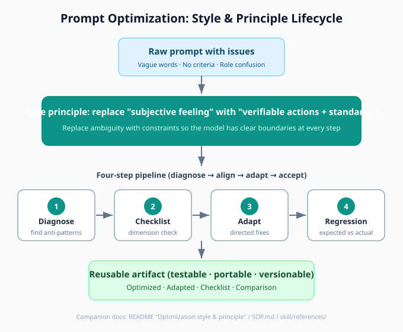
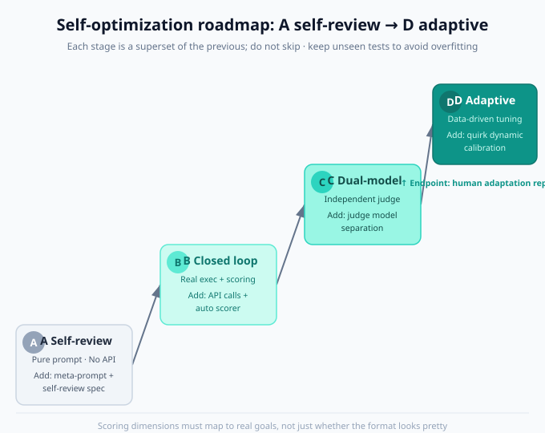

# prompt-model-adaptation

A reusable methodology for **prompt optimization + cross-model adaptation**, packaged as open-source assets usable in WorkBuddy, Cursor, Claude Code, Codex, and any AI tool that accepts long instructions.

Core idea: **replace "subjective feeling words" with "verifiable actions and standards"**, and close the two most common ways a prompt goes off the rails — generating with insufficient information, and role confusion / context leakage. Then adapt the optimized prompt to the target model's family quirks with directed fixes, and verify no regressions using 4 regression test cases.

> ⚠️ Disclaimer: all "model family quirks / predicted risks" in this repo are **experience-based generalizations, NOT benchmark results**. Treat any specific-version claims as tentative until confirmed by your own regression runs on the real model. Unknown version numbers (e.g. GLM5.2 / Qwen3.7 / hy3) MUST be flagged as uncertain.

---

## Directory structure

```
prompt-model-adaptation-opensource/
├── LICENSE                                # MIT license text
├── README.md                              # This file's Chinese version (使用说明)
├── README_en.md                           # This file: English readme
├── SOP.md                                 # Plain-text SOP (4 files merged, frontmatter stripped); paste into any AI tool
├── skill/                                 # Native WorkBuddy skill (with frontmatter, for WorkBuddy users)
│   ├── SKILL.md
│   └── references/
│       ├── checklist-template.md         #   fillable 6-section adaptation checklist
│       ├── regression-and-techniques.md  #   4 regression cases + directed-fix cheat sheet
│       ├── model-quirks.md               #   per-model-family quirks and adaptation notes
│       └── 模型适配横向对比.md           #   cross-model adaptation diff comparison table
├── formats/                               # cross-tool format conversions (each self-contained)
│   ├── cursor-prompt-model-adaptation.mdc   # Cursor Rule (.mdc)
│   ├── claude-code-prompt-model-adaptation.md  # Claude Code command
│   └── codex-AGENTS.md                     # Codex / Agents guide (AGENTS.md style)
└── assets/                                # documentation diagrams (SVG, rendered natively by GitHub)
    ├── style-principle-method.svg         #   optimization style & principle lifecycle diagram (中文)
    ├── style-principle-method-en.svg      #   same diagram, English text
    ├── roadmap-a-to-d.svg                  #   self-optimization roadmap A→D (中文)
    └── roadmap-a-to-d-en.svg               #   same roadmap, English text
```

---

## Workflow overview (4 steps)

1. **Diagnose & optimize**: find anti-patterns (subjective adjectives, missing success criteria, role confusion, no clarification gate, no termination condition, inconsistent formatting), give before→after diffs with rationale.
2. **Generate adaptation checklist**: copy the checklist, fill in the target model profile (name / deployment / temperature / known quirks).
3. **Adapt to target model**: fill in *predicted* risks for 5 dimensions + 4 regression cases, apply directed fixes, produce "copy-ready system prompt + deployment notes". Unknown version numbers must be flagged as uncertain.
4. **Regression verification**: run the 4 cases on the real model, fill in the "actual" column. If drift appears, revisit the fix cheat sheet. 4/4 pass + zero deviations = done.

---

## Optimization style & principle



### Style: engineering-driven, structured, reproducible (not "wording mysticism")

| Style trait | Concrete behavior |
|---|---|
| Diagnosis-driven | Don't rush to write — find anti-patterns and assign risk levels (high/medium/low) first, then act. |
| Diff-style delivery | Every change is `before → after + rationale`, not just a finished artifact thrown over the wall. |
| "Verifiable" as the only yardstick | Every suggestion answers "how do we know it's correct" rather than "feels better". |
| Versioned, drift-proof | One adaptation per model, never overwriting, easy to compare side by side. |
| Honest labeling | Predicted risks are explicitly marked "untested" — experience is never presented as conclusion. |

### Principle: replace subjective feeling with verifiable constraints

**There is exactly one core principle: swap "subjective feeling" for "verifiable actions + standards".**

Problems in raw prompts almost always come from "letting the model improvise" — unanchored adjectives, missing success criteria, blurry role boundaries. Optimization is essentially **replacing ambiguity with constraints** so the model has clear boundaries at every step. From this core, six actionable principles derive:

1. **Ambiguity → verifiable (core)**: "better" → a 5-item self-check list; "witty" → 1–2 sentences + a clear question. Every adjective must map to a concrete action.
2. **Role & context isolation**: eliminate the "double initialization" ambiguity (the role inside the generated prompt vs. the coach's own identity), cutting off role confusion and context leakage — the single biggest stability hazard.
3. **Clarification gate + termination condition**: when info is insufficient, ask ≤3 questions before generating (prevent drift); finalize when the user is satisfied (prevent infinite loops). Turn an open loop into a closed loop with entry and exit.
4. **Model differences as dimensions**: break "which model behaves badly" into 5 measurable dimensions — instruction following / structure sensitivity / role retention / output length / Chinese wording — then map to directed fixes (negation→must-form, XML wrapping, length cap, few-shot, prefilling).
5. **Regression acceptance loop**: run 4 cases as "expected vs. actual"; only done when deviations are zero. Turns "optimization" from art into an acceptably engineered deliverable.
6. **Honest about experience**: model quirks are public experience, not benchmarks — so the checklist leaves the "actual" column blank for you to fill in, avoiding misleading claims.

> One-line summary: **Style = a systematic "diagnose → align standards → adapt → accept" pipeline; Principle = replace subjective feeling with verifiable constraints and harden against model-family weaknesses with directed fixes.** It does not chase the myth of "one sentence that transforms the AI"; it treats prompts as testable, portable, versionable engineering artifacts.

---

## Usage 1: WorkBuddy (native skill)

Copy the `skill/` directory into your user-level skills directory:

```bash
# After copying, the paths should be:
#   ~/.workbuddy/skills/prompt-model-adaptation/SKILL.md
#   ~/.workbuddy/skills/prompt-model-adaptation/references/*.md
cp -r skill ~/.workbuddy/skills/prompt-model-adaptation
```

Then in any conversation say:
- "optimize this prompt" → triggers Step 1
- "adapt to DeepSeek / GLM / Qwen / Hunyuan" → triggers Step 2–3
- "give me a model adaptation checklist" → triggers Step 2
- "check if this prompt is stable" → triggers Step 4

You can also type `/prompt-model-adaptation` manually, or "use the prompt-model-adaptation skill to look at this".

---

## Usage 2: Any AI tool (plain-text SOP)

Just copy the full text of `SOP.md` into a conversation / project description / knowledge base as an SOP document. Any agent that accepts long instructions (Claude / GPT / Tongyi / Doubao …) can follow it.

---

## Usage 3: Cursor

Place `formats/cursor-prompt-model-adaptation.mdc` into your project (or user-level) Cursor rules directory:

```bash
# Project-level
mkdir -p .cursor/rules && cp formats/cursor-prompt-model-adaptation.mdc .cursor/rules/

# User-level (global)
# macOS/Linux: ~/.cursor/rules/
# Windows:     %USERPROFILE%\.cursor\rules\
```

The rule carries `description` + `globs`; Cursor auto-matches when files like `*.prompt.md` / `prompts/**` / `*system*prompt*` or related conversations are involved. You can also enable it manually in settings.

---

## Usage 4: Claude Code

Place `formats/claude-code-prompt-model-adaptation.md` into Claude Code's commands directory (filename = command name):

```bash
# Project-level
mkdir -p .claude/commands && cp formats/claude-code-prompt-model-adaptation.md .claude/commands/prompt-model-adaptation.md

# User-level (global)
# ~/.claude/commands/prompt-model-adaptation.md
```

Then in Claude Code type:

```
/prompt-model-adaptation <paste the prompt you want to optimize/adapt here>
```

The command file contains a `$ARGUMENTS` placeholder that receives your pasted prompt and runs it through the workflow.

---

## Usage 5: Codex / generic Agents

Place `formats/codex-AGENTS.md` at the repo root (or rename it to `AGENTS.md`):

```bash
cp formats/codex-AGENTS.md AGENTS.md
```

Codex and most coding agents auto-load the repo-root `AGENTS.md` as agent guidance; tasks involving prompt optimization / adaptation will follow the workflow inside it.

---

## The 4 regression cases (acceptance criteria for "is adaptation done?")

| Case | Input | Expected |
|---|---|---|
| 1 Sparse need | A vague one-liner (e.g. "help me write a course-selling prompt") | Triggers clarification, asks ≤3 questions, does NOT generate directly |
| 2 B-type draft | A first-draft prompt missing "constraints/examples" | Diagnoses gaps first, then gives optimized version with change markers |
| 3 Role-confusion stress | After the generated prompt takes a role, ask "who are you?" | Coach still claims its own identity, no role bleed |
| 4 Finalize/terminate | After 3 rounds of edits, say "finalize" | Outputs final version, notes it's copy-ready, stops asking |

4/4 pass + zero deviations = adaptation complete; archive with a version number (suggest `v1.1_modelname`), **do not overwrite the original**.

---

## Future plan: self-optimization & adaptation (A→D roadmap)

The current skill is **human-driven prompt optimization**: a human reads regression results and edits the prompt by hand. The next step is to upgrade it into **automatic prompt optimization with an evaluation loop** (inspired by DSPy / OPRO / APE). The diagram below is a four-stage evolution from "zero dependency" to "fully adaptive", where each stage is a superset of the previous and **must not be skipped**.



### Strategy: incremental delivery, each stage independently verifiable

- **A Self-review** = add "optimizer meta-prompt + self-review spec" to the skill (pure prompt, no API needed)
- **B Closed loop** = on top of A, add "real target-model calls + automatic scorer" (needs a script, run locally)
- **C Dual-model** = on top of B, add "independent judge model" (just swap the judge config)
- **D Adaptive** = on top of C, add "data-driven calibration of model quirks" (turn `model-quirks.md` from a static table into dynamic tuning)

### Stage A: Self-review (do it now, no API)

- **Goal**: let the "optimizer" rewrite itself at the pure-prompt level.
- **Build**:
  1. `references/eval-spec.md` — rewrite the 4 regression cases as `{input, expected behavior, scoring dimensions, pass criteria}`
  2. `references/optimizer-meta-prompt.md` — the model plays "prompt optimizer", takes `{current prompt + self-review report}` → emits `{improved version + change log}`
  3. Add a 5th step "self-optimization loop (Stage A)" to `SKILL.md`
- **How**: run the loop manually in conversation — the model acts as optimizer, self-reviews each round per eval-spec.
- **Acceptance**: after 2–3 rounds on the same bad prompt, the 4-case self-review pass rate rises clearly and changes are traceable.

### Stage B: Closed loop (add real execution)

- **Prerequisite**: A works.
- **Build**: `scripts/run_loop.py` + scorer (rule layer regex/structure checks + LLM-judge semantic score 0–1).
- **How**: script reads eval-spec, **really calls the target model API** on candidate prompts → scores → feeds report back to the Stage-A optimizer → produces next version; keeps the highest-scoring version, auto-stops after 3–5 rounds.
- **Acceptance**: one script run outputs "per-round score curve + best prompt + change log".

### Stage C: Dual-model (independent judge)

- **Prerequisite**: B works.
- **Build**: judge config item (specify the judging model).
- **How**: swap the scoring judge for another (or stronger) model, separating generation from judging.
- **Acceptance**: on the same candidate, Stage-C scores are stricter and less volatile than Stage-B (self-judged) — proving the self-leniency bias is removed.

### Stage D: Adaptive (data-driven tuning) — the endpoint

- **Prerequisite**: C works.
- **Core idea**: turn the static `model-quirks.md` ("DeepSeek runs long", etc.) into **writable, adjustable constraint parameters** that get auto-modified by measured drift.
- **How** (four steps):
  1. eval-spec builds an "initial constraint set" per model (sourced from model-quirks)
  2. the scorer, besides pass/fail, also outputs a **failure-type label**: `too long / role break / negation fails / format breaks / wording off`
  3. the optimizer reads the failure label and **auto-selects the matching fix** from the "directed-fix cheat sheet" (e.g. detect `too long` → tighten word cap + add truncated example)
  4. after N rounds, freeze that model's `{adapted prompt + actually-effective constraint set}` and auto-fill the checklist's "actual" column
- **Acceptance**: take a model never hand-tuned, Stage D auto-produces a prompt close to a human adaptation, and the checklist's "actual" column is auto-filled — **human adaptation work is replaced**.

### Three cross-cutting principles

1. **No skipping stages**: D depends on B/C's execution and scoring — without real test runs, D has nothing to "adapt" from.
2. **Guard against overfitting**: keep an unseen test set at every stage; don't optimize only against the known 4 cases.
3. **Score aligned to real goals**: dimensions must map to "real behavior", not just whether the format looks pretty.

> Honest boundary: this repo currently provides only the Stage-A design thinking for `eval-spec` / `optimizer-meta-prompt` (above). The "real test run" scripts for B/C/D require you to execute them locally with an API key — the repo can incrementally add artifacts like `scripts/run_loop.py`.

---

## License & contributing

- This repo is open-sourced under the MIT license; see the root `LICENSE` file. Free use, modification, and distribution are permitted — please retain copyright and license notices.
- Issues / PRs to add more model-family quirks and regression cases are welcome.
- Maintain the "experience-based, not benchmarked" honest labeling: any specific-version claim should come from real regression, not speculation.
