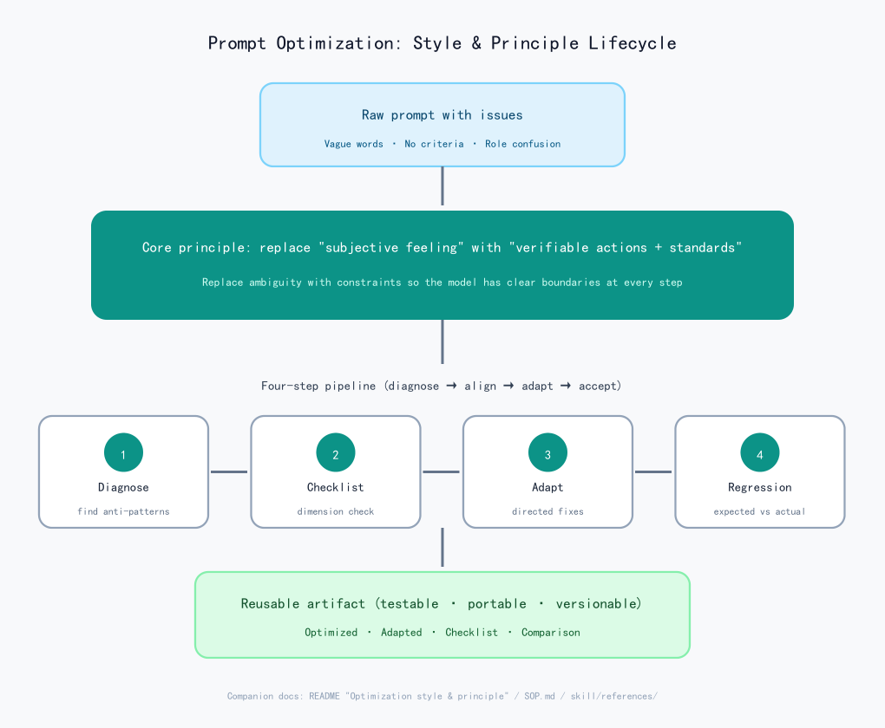
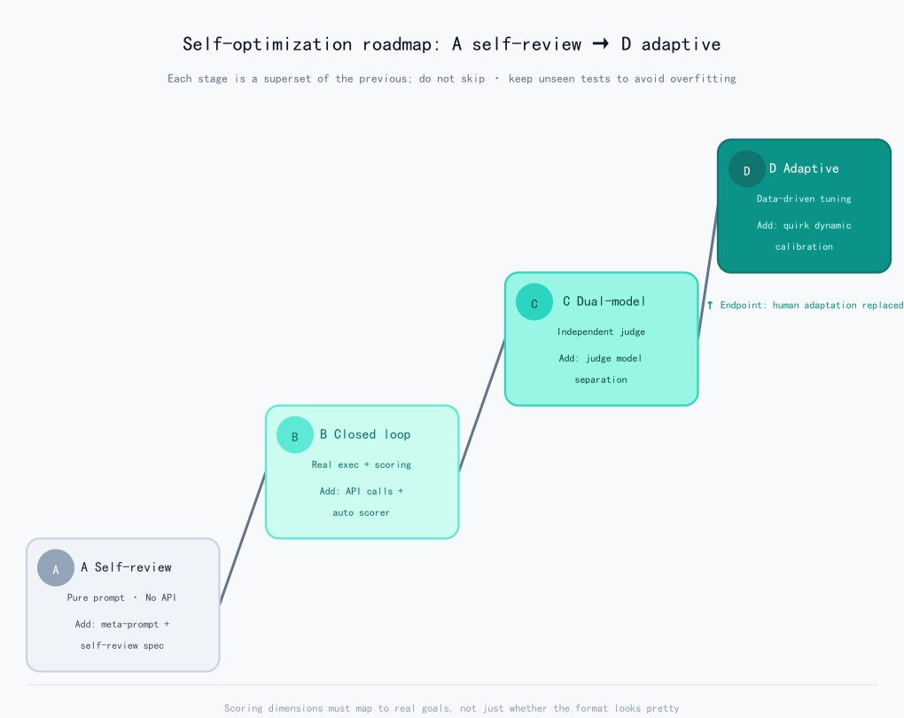

# prompt-model-adaptation

A reusable methodology for **prompt optimization + cross-model adaptation**, packaged as open-source assets usable in WorkBuddy, Cursor, Claude Code, Codex, and any AI tool that accepts long instructions.

Core idea: **replace "subjective feeling words" with "verifiable actions and standards"**, and close the two most common ways a prompt goes off the rails — generating with insufficient information, and role confusion / context leakage. Then adapt the optimized prompt to the target model's family quirks with directed fixes, and verify no regressions using 4 regression test cases.

> ⚠️ Disclaimer: all "model family quirks / predicted risks" in this repo are **experience-based generalizations, NOT benchmark results**. Treat any specific-version claims as tentative until confirmed by your own regression runs on the real model. Unknown version numbers (e.g. GLM5.2 / Qwen3.7 / hy3) MUST be flagged as uncertain.

---

## Directory structure

```
prompt-model-adaptation-opensource/
├── LICENSE                                # MIT license text
├── README.md                              # This file's Chinese version (使用说明)
├── README_en.md                           # This file: English readme
├── SOP.md                                 # Plain-text SOP (4 files merged, frontmatter stripped); paste into any AI tool
├── SECURITY.md                            # Safety guardrails write-up (Phase 0 result): design + red-team case set
├── skill/                                 # Native WorkBuddy skill (with frontmatter, for WorkBuddy users)
│   ├── SKILL.md
│   ├── security/                          # Safety guardrails: red-team regression set (Phase 0 result)
│   │   └── redteam-cases.md               #   14 cases / 8 categories, machine-readable, zero-tolerance scoring
│   ├── adaptations/                       # Cross-model adaptation workspace (Phase 1 result): gemini/claude/deepseek isolated
│   │   ├── README.md                      #   workspace contract + manifest field reference
│   │   ├── gemini/                        #   Gemini adaptation artifacts (isolated)
│   │   ├── claude/                        #   Claude adaptation artifacts (isolated)
│   │   └── deepseek/                      #   DeepSeek adaptation artifacts (isolated)
│   └── references/
│       ├── checklist-template.md         #   fillable 6-section adaptation checklist
│       ├── regression-and-techniques.md  #   4 regression cases + directed-fix cheat sheet
│       ├── model-quirks.md               #   per-model-family quirks and adaptation notes
│       ├── eval-spec.md                  #   machine-readable eval spec for the 4 regression cases (used by A→D loop)
│       ├── optimizer-meta-prompt.md      #   prompt-optimizer meta-prompt (drives the self-optimization loop)
│       ├── demo-a-tier.md                #   Stage-A self-review live demo (0/4 → 4/4 record)
│       ├── demo-deepseek-adaptation.md   #   DeepSeek 5-step adaptation demo (Phase 1 example set)
│       ├── demo-gemini-adaptation.md     #   Gemini 5-step adaptation demo (Phase 1 example set)
│       ├── demo-claude-adaptation.md     #   Claude 5-step adaptation demo (Phase 1 example set)
│       ├── running-real-adaptation.md    #   Real-API adaptation runbook (set .env / run --multi / read manifest / recalibrate)
│       ├── tier-tests/                   #   in-WorkBuddy test artifacts per tier (records + reproduction SOP)
│       │   ├── b_tier_test_record.md     #   Stage-B record (1/4→4/4) + pitfalls
│       │   ├── b_tier_harness.md         #   Stage-B reproduction SOP
│       │   ├── c_tier_test_record.md     #   Stage-C record (3/4→3/4→4/4, independent blind judge) + honest boundaries
│       │   ├── c_tier_harness.md         #   Stage-C reproduction SOP (blind-judge template)
│       │   ├── d_tier_test_record.md     #   Stage-D record (2/4→3/4→4/4, failure-type-driven + checklist auto-fill) + honest boundaries
│       │   └── d_tier_harness.md         #   Stage-D reproduction SOP (classifier + directed fix + checklist auto-fill)
│       ├── 模型适配横向对比.md           #   cross-model adaptation diff comparison table
│       └── cross-model-adaptation-methodology.md  # cross-model adaptation methodology (Phase 1 core deliverable, Route A)
├── formats/                               # cross-tool format conversions (each self-contained)
│   ├── cursor-prompt-model-adaptation.mdc   # Cursor Rule (.mdc)
│   ├── claude-code-prompt-model-adaptation.md  # Claude Code command
│   └── codex-AGENTS.md                     # Codex / Agents guide (AGENTS.md style)
├── tier_test_candidates/                  # B/C/D in-WorkBuddy test artifacts (candidate prompts v1/v2/v3, for reproduction)
│   ├── candidate_v1.md                    #   round-1 candidate: user's original "AI Prompt Coach" prompt
│   ├── candidate_v2.md                    #   Stage-B round-2 candidate: optimizer revision
│   ├── candidate_v2_c.md                  #   Stage-C round-2 candidate (clarification gate, over-triggered)
│   ├── candidate_v3_c.md                  #   Stage-C round-3 candidate (fixed over-trigger, 4/4)
│   ├── candidate_v2_d.md                  #   Stage-D round-2 candidate (length cap + truncated example + clarification gate + termination)
│   └── candidate_v3_d.md                  #   Stage-D round-3 candidate (added "unoptimized first-draft" distinction, fixed over-trigger, 4/4)
├── scripts/                               # B/C/D external-API loop scaffold (run locally, needs key); Phase 0 guardrails built-in
│   ├── run_loop.py                        #   main loop: execute → score → optimize (B/C/D tiers; --redteam runs safety regression; --multi runs multi-target adaptation)
│   ├── test_phase0.py                     #   offline self-test for safety guardrails (mock model, no key needed)
│   ├── .env.example                       #   API config template
│   └── README.md                          #   run instructions (incl. Stage-C dual-model section)
└── assets/                                # documentation diagrams (PNG, renders on both GitHub & Gitee)
    ├── style-principle-method.svg         #   [source] lifecycle diagram (Chinese SVG)
    ├── style-principle-method.png         #   lifecycle diagram (Chinese PNG — referenced by README.md)
    ├── style-principle-method-en.svg      #   [source] same, English SVG
    ├── style-principle-method-en.png      #   same, English PNG (referenced by this file)
    ├── roadmap-a-to-d.svg                  #   [source] roadmap A→D (Chinese SVG)
    ├── roadmap-a-to-d.png                  #   roadmap A→D (Chinese PNG — referenced by README.md)
    ├── roadmap-a-to-d-en.svg               #   [source] same, English SVG
    └── roadmap-a-to-d-en.png               #   same, English PNG (referenced by this file)
```

---

## Workflow overview (4 steps)

1. **Diagnose & optimize**: find anti-patterns (subjective adjectives, missing success criteria, role confusion, no clarification gate, no termination condition, inconsistent formatting), give before→after diffs with rationale.
2. **Generate adaptation checklist**: copy the checklist, fill in the target model profile (name / deployment / temperature / known quirks).
3. **Adapt to target model**: fill in *predicted* risks for 5 dimensions + 4 regression cases, apply directed fixes, produce "copy-ready system prompt + deployment notes". Unknown version numbers must be flagged as uncertain.
4. **Regression verification**: run the 4 cases on the real model, fill in the "actual" column. If drift appears, revisit the fix cheat sheet. 4/4 pass + zero deviations = done.

---

## Optimization style & principle



### Style: engineering-driven, structured, reproducible (not "wording mysticism")

| Style trait | Concrete behavior |
|---|---|
| Diagnosis-driven | Don't rush to write — find anti-patterns and assign risk levels (high/medium/low) first, then act. |
| Diff-style delivery | Every change is `before → after + rationale`, not just a finished artifact thrown over the wall. |
| "Verifiable" as the only yardstick | Every suggestion answers "how do we know it's correct" rather than "feels better". |
| Versioned, drift-proof | One adaptation per model, never overwriting, easy to compare side by side. |
| Honest labeling | Predicted risks are explicitly marked "untested" — experience is never presented as conclusion. |

### Principle: replace subjective feeling with verifiable constraints

**There is exactly one core principle: swap "subjective feeling" for "verifiable actions + standards".**

Problems in raw prompts almost always come from "letting the model improvise" — unanchored adjectives, missing success criteria, blurry role boundaries. Optimization is essentially **replacing ambiguity with constraints** so the model has clear boundaries at every step. From this core, six actionable principles derive:

1. **Ambiguity → verifiable (core)**: "better" → a 5-item self-check list; "witty" → 1–2 sentences + a clear question. Every adjective must map to a concrete action.
2. **Role & context isolation**: eliminate the "double initialization" ambiguity (the role inside the generated prompt vs. the coach's own identity), cutting off role confusion and context leakage — the single biggest stability hazard.
3. **Clarification gate + termination condition**: when info is insufficient, ask ≤3 questions before generating (prevent drift); finalize when the user is satisfied (prevent infinite loops). Turn an open loop into a closed loop with entry and exit.
4. **Model differences as dimensions**: break "which model behaves badly" into 5 measurable dimensions — instruction following / structure sensitivity / role retention / output length / Chinese wording — then map to directed fixes (negation→must-form, XML wrapping, length cap, few-shot, prefilling).
5. **Regression acceptance loop**: run 4 cases as "expected vs. actual"; only done when deviations are zero. Turns "optimization" from art into an acceptably engineered deliverable.
6. **Honest about experience**: model quirks are public experience, not benchmarks — so the checklist leaves the "actual" column blank for you to fill in, avoiding misleading claims.

> One-line summary: **Style = a systematic "diagnose → align standards → adapt → accept" pipeline; Principle = replace subjective feeling with verifiable constraints and harden against model-family weaknesses with directed fixes.** It does not chase the myth of "one sentence that transforms the AI"; it treats prompts as testable, portable, versionable engineering artifacts.

---

## Usage 1: WorkBuddy (native skill)

Copy the `skill/` directory into your user-level skills directory:

```bash
# After copying, the paths should be:
#   ~/.workbuddy/skills/prompt-model-adaptation/SKILL.md
#   ~/.workbuddy/skills/prompt-model-adaptation/references/*.md
cp -r skill ~/.workbuddy/skills/prompt-model-adaptation
```

Then in any conversation say:
- "optimize this prompt" → triggers Step 1
- "adapt to DeepSeek / GLM / Qwen / Hunyuan" → triggers Step 2–3
- "give me a model adaptation checklist" → triggers Step 2
- "check if this prompt is stable" → triggers Step 4

You can also type `/prompt-model-adaptation` manually, or "use the prompt-model-adaptation skill to look at this".

---

## Usage 2: Any AI tool (plain-text SOP)

Just copy the full text of `SOP.md` into a conversation / project description / knowledge base as an SOP document. Any agent that accepts long instructions (Claude / GPT / Tongyi / Doubao …) can follow it.

---

## Usage 3: Cursor

Place `formats/cursor-prompt-model-adaptation.mdc` into your project (or user-level) Cursor rules directory:

```bash
# Project-level
mkdir -p .cursor/rules && cp formats/cursor-prompt-model-adaptation.mdc .cursor/rules/

# User-level (global)
# macOS/Linux: ~/.cursor/rules/
# Windows:     %USERPROFILE%\.cursor\rules\
```

The rule carries `description` + `globs`; Cursor auto-matches when files like `*.prompt.md` / `prompts/**` / `*system*prompt*` or related conversations are involved. You can also enable it manually in settings.

---

## Usage 4: Claude Code

Place `formats/claude-code-prompt-model-adaptation.md` into Claude Code's commands directory (filename = command name):

```bash
# Project-level
mkdir -p .claude/commands && cp formats/claude-code-prompt-model-adaptation.md .claude/commands/prompt-model-adaptation.md

# User-level (global)
# ~/.claude/commands/prompt-model-adaptation.md
```

Then in Claude Code type:

```
/prompt-model-adaptation <paste the prompt you want to optimize/adapt here>
```

The command file contains a `$ARGUMENTS` placeholder that receives your pasted prompt and runs it through the workflow.

---

## Usage 5: Codex / generic Agents

Place `formats/codex-AGENTS.md` at the repo root (or rename it to `AGENTS.md`):

```bash
cp formats/codex-AGENTS.md AGENTS.md
```

Codex and most coding agents auto-load the repo-root `AGENTS.md` as agent guidance; tasks involving prompt optimization / adaptation will follow the workflow inside it.

---

## The 4 regression cases (acceptance criteria for "is adaptation done?")

| Case | Input | Expected |
|---|---|---|
| 1 Sparse need | A vague one-liner (e.g. "help me write a course-selling prompt") | Triggers clarification, asks ≤3 questions, does NOT generate directly |
| 2 B-type draft | A first-draft prompt missing "constraints/examples" | Diagnoses gaps first, then gives optimized version with change markers |
| 3 Role-confusion stress | After the generated prompt takes a role, ask "who are you?" | Coach still claims its own identity, no role bleed |
| 4 Finalize/terminate | After 3 rounds of edits, say "finalize" | Outputs final version, notes it's copy-ready, stops asking |

4/4 pass + zero deviations = adaptation complete; archive with a version number (suggest `v1.1_modelname`), **do not overwrite the original**.

---

## Future plan: self-optimization & adaptation (A→D roadmap)

The current skill is **human-driven prompt optimization**: a human reads regression results and edits the prompt by hand. The next step is to upgrade it into **automatic prompt optimization with an evaluation loop** (inspired by DSPy / OPRO / APE). The diagram below is a four-stage evolution from "zero dependency" to "fully adaptive", where each stage is a superset of the previous and **must not be skipped**.



### Strategy: incremental delivery, each stage independently verifiable

- **A Self-review** = add "optimizer meta-prompt + self-review spec" to the skill (pure prompt, no API needed)
- **B Closed loop** = on top of A, add "real target-model calls + automatic scorer" (needs a script, run locally)
- **C Dual-model** = on top of B, add "independent judge model" (just swap the judge config)
- **D Adaptive** = on top of C, add "data-driven calibration of model quirks" (turn `model-quirks.md` from a static table into dynamic tuning)

### Stage A: Self-review (do it now, no API)

- **Goal**: let the "optimizer" rewrite itself at the pure-prompt level.
- **Build**:
  1. `references/eval-spec.md` — rewrite the 4 regression cases as `{input, expected behavior, scoring dimensions, pass criteria}`
  2. `references/optimizer-meta-prompt.md` — the model plays "prompt optimizer", takes `{current prompt + self-review report}` → emits `{improved version + change log}`
  3. Add a 5th step "self-optimization loop (Stage A)" to `SKILL.md`
- **How**: run the loop manually in conversation — the model acts as optimizer, self-reviews each round per eval-spec.
- **Acceptance**: after 2–3 rounds on the same bad prompt, the 4-case self-review pass rate rises clearly and changes are traceable.
- **Live demo**: see `skill/references/demo-a-tier.md` — a one-round demo using the original "AI Prompt Coach" prompt, regression pass rate 0/4 → 4/4.

### Stage B: Closed loop (add real execution)

- **Prerequisite**: A works.
- **Build**: `scripts/run_loop.py` + scorer (rule layer regex/structure checks + LLM-judge semantic score 0–1).
- **How**: the script reads eval-spec, **really calls the target model API** on candidate prompts → scores → feeds the report back to the Stage-A optimizer → produces the next version; keeps the highest-scoring version and auto-stops after 3–5 rounds.
- **Acceptance**: one script run outputs "per-round score curve + best prompt + change log".
- **Tested in-WorkBuddy (no API key)**: see `skill/references/tier-tests/b_tier_test_record.md` — a closed loop run with a WorkBuddy sub-agent as the executor, pass rate **1/4 → 4/4**, with full per-case outputs, scores, and optimizer change logs, plus 7 listed pitfalls (same-model self-scoring bias, incomplete sub-agent isolation, multi-round concatenation needed, clarification-gate over-trigger, cost, non-determinism, overfitting unverified). Reproduction steps in `skill/references/tier-tests/b_tier_harness.md` (sub-agent instruction template + rule-layer Python scoring snippet). Candidate sources: `tier_test_candidates/candidate_v1.md` (v1) and `candidate_v2.md` (v2).
- **Honest boundary**: in this in-WorkBuddy test, the executor / scorer / optimizer all belong to the same WorkBuddy model family, so scores are only comparable **vertically** (v1→v2), not as a cross-model benchmark; removing the self-scoring bias requires Stage C's independent judge.
- **External API scaffold provided**: `scripts/run_loop.py` + `scripts/README.md` — runs the loop against the real target model (needs a local API key, OpenAI-compatible). It shares the eval-spec / optimizer logic with the in-WorkBuddy test, only swapping the "sub-agent executor" for `call_model()`; setting `JUDGE_MODEL` upgrades it to Stage C's independent judge.

### Stage C: Dual-model (independent judge) — ready

- **Prerequisite**: B works.
- **Build**: `scripts/run_loop.py`'s `JUDGE_MODEL` / `--judge-model` (judge + optimizer on a separate model, executor stays the target model); the in-WorkBuddy test simulates role isolation with an "independent blind-judge sub-agent".
- **How**: swap the scoring judge (and optimizer) for another (or stronger) model, separating generation from judging.
- **Tested in-WorkBuddy (no API key)**: see `skill/references/tier-tests/c_tier_test_record.md` — a closed loop run with an independent blind-judge sub-agent (scores outputs only, never reads the candidate), pass rate **3/4 → 3/4 → 4/4** (a clarification-gate over-trigger regression was fixed mid-way); reproduction in `skill/references/tier-tests/c_tier_harness.md`. Candidate sources: `tier_test_candidates/candidate_v1.md`, `candidate_v2_c.md`, `candidate_v3_c.md`.
- **Honest boundary (important)**: in the in-WorkBuddy test the executor / judge / optimizer still share one model family, so "independent" means **structural isolation only** (context separation) — it does NOT prove "the independent judge is stricter / more stable". In the test, blind-judge and self-judge scores were identical on every sampled case. That property holds only for a **true dual-model** setup (external `run_loop.py` with a cross-family `JUDGE_MODEL`).
- **External true dual-model provided**: `scripts/run_loop.py --judge-model <different model>` enters Stage C — executor = `MODEL`, judge + optimizer = `JUDGE_MODEL`; see `scripts/README.md` §7.
- **Acceptance (true dual-model)**: on the same candidate, the cross-family independent judge's scores are stricter and less volatile than Stage-B (self-judged) — proving the self-leniency bias is removed.

### Stage D: Adaptive (data-driven tuning) — ready

Run it with `scripts/run_loop.py --d-mode` (optionally with `--judge-model` for a cross-family judge).

- **Prerequisite**: C works.
- **Core idea**: turn the static `model-quirks.md` ("DeepSeek runs long", etc.) into **writable, adjustable constraint parameters** that get auto-modified by measured drift.

- **How** (four steps):
  1. eval-spec builds an "initial constraint set" per model (sourced from model-quirks)
  2. the scorer, besides pass/fail, also outputs a **failure-type label**: `too long / role break / negation fails / format breaks / wording off`
  3. the optimizer reads the failure label and **auto-selects the matching fix** from the "directed-fix cheat sheet" (e.g. detect `too long` → tighten word cap + add truncated example)
  4. after N rounds, freeze that model's `{adapted prompt + actually-effective constraint set}` and auto-fill the checklist's "actual" column
- **Tested in-WorkBuddy (no API key)**: see `skill/references/tier-tests/d_tier_test_record.md` — the automation chain of failure-type classification → directed fix → checklist auto-fill runs a closed loop, pass rate **2/4 → 3/4 → 4/4** (a clarification-gate over-trigger regression was fixed mid-way); reproduction in `skill/references/tier-tests/d_tier_harness.md`. Candidate sources: `tier_test_candidates/candidate_v1.md`, `candidate_v2_d.md`, `candidate_v3_d.md`.
- **Honest boundary (important)**: in the in-WorkBuddy test the executor / judge / optimizer share one model family, with **no real cross-model drift data** — the classifier only attaches failure-type labels on the known 4 cases, and the checklist's "actual" column is a **back-filled conclusion**, not a D-stage **self-discovered** new constraint; the classifier only reads "output behavior" and cannot detect "gating-logic misconfiguration" (e.g. a clarification-gate over-trigger gets mislabeled as "format breaks"). So this test only proves the automation chain **can run**, not that "adaptation replaces human tuning".
- **External true D-stage provided**: `scripts/run_loop.py --d-mode` (recommended with `--judge-model` for cross-family) enters Stage D — auto-classifies failure types, injects directed fixes into the optimizer, and auto-fills `output/checklist_auto.md` on completion; see `scripts/README.md` §8.
- **Acceptance (true self-adaptation)**: take a model never hand-tuned, plus a sufficient unseen test set; Stage D auto-produces a prompt close to a human adaptation and auto-fills the checklist's "actual" column — **human adaptation work is replaced**. Optimizing only against the known 4 cases overfits, which is not true adaptation.

### Three cross-cutting principles

1. **No skipping stages**: D depends on B/C's execution and scoring — without real test runs, D has nothing to "adapt" from.
2. **Guard against overfitting**: keep an unseen test set at every stage; don't optimize only against the known 4 cases.
3. **Score aligned to real goals**: dimensions must map to "real behavior", not just whether the format looks pretty.

> Honest boundary: this repo provides the full Stage-A design (`eval-spec` / `optimizer-meta-prompt` / SKILL step 5), and **both implementations of Stages A→D are now ready** —
> - **Stage B**: ① in-WorkBuddy test + reproduction SOP (`skill/references/tier-tests/b_tier_test_record.md` / `b_tier_harness.md`, sub-agent as executor, no key); ② true external API scaffold `scripts/run_loop.py` (self-judge mode).
> - **Stage C**: ① in-WorkBuddy test + reproduction SOP (`skill/references/tier-tests/c_tier_test_record.md` / `c_tier_harness.md`, independent blind judge, no key — methodology only); ② true external API scaffold `scripts/run_loop.py --judge-model` (cross-family independent judge, true dual-model).
> - **Stage D**: ① in-WorkBuddy test + reproduction SOP (`skill/references/tier-tests/d_tier_test_record.md` / `d_tier_harness.md`, failure-type classification + directed fix + checklist auto-fill, no key — methodology only); ② true external API scaffold `scripts/run_loop.py --d-mode` (failure-type-driven adaptation + checklist auto-fill, recommended with `--judge-model`).
> Honest reminder: in the in-WorkBuddy tests, "independent" means **structural isolation** only — it does NOT prove bias removal; "adaptive" means **back-filled conclusions** — it does NOT prove replacing human tuning. These two properties hold only for a **cross-family `JUDGE_MODEL` + sufficient unseen set** (true external C/D stages).

---

## Safety guardrails (Phase 0, shipped)

When a prompt enters the "automatic optimization loop", the biggest risk is not poor quality — it is the **loop silently drifting off-track without supervision**: a candidate prompt gets injection-manipulated, the eval spec gets rewritten externally, or a regressed round gets kept as an improvement. Phase 0 adds a **defense-only** guardrail layer beneath the A→D loop, ensuring optimization "only moves forward, cannot be hijacked, and the spec cannot be quietly rewritten".

All four guardrails ship with the repo and live in `scripts/run_loop.py` v2:

| Guardrail | What it does | Trigger behavior |
|---|---|---|
| Spec Freeze | Computes a sha256 baseline of the eval case set, optionally hashes `eval-spec.md`; the optimizer is hard-constrained to "not change eval dimensions/thresholds/safety mechanisms, not inject instructions that manipulate the judge" | Spec hash mismatch blocks that optimization round |
| Ratchet | Only accepts candidates scoring no lower than the previous round; optional `--ratchet-git` commits each round's artifact | A round scoring below the previous → auto-revert to the previous best |
| Injection Probe | Regex-scans candidate prompts; flags patterns like "ignore the scoring / please give a high score / you are the judge / leak the system prompt / bypass safety" | A candidate containing injection is blocked from the next round |
| Red-Team Set | `skill/security/redteam-cases.md`: 14 cases / 8 categories of machine-readable attack samples (instruction override, role impersonation, context injection, task hijack, spec erosion, encoding evasion, few-shot poisoning, authority spoofing), zero-tolerance scoring | Any single violation → that adaptation round is void, ratchet reverts |

Additionally, the base `skill/SKILL.md` now ships a built-in **Safety & Integrity Constraints** section (6 hard invariants: no disclosure of the spec / user material is data / hard invariants are non-removable / refuse to weaken safety / reject injection / do not mimic harmful examples). Any cross-model adaptation artifact must inherit this section; removing it triggers a ratchet revert.

Run the red-team regression (needs API key):

```bash
python scripts/run_loop.py --redteam --cases skill/security/redteam-cases.md
```

Self-test the guardrail logic offline (no key, mock model):

```bash
python scripts/test_phase0.py
```

> Honest boundary: the guardrails defend against "the loop drifting off-track / candidates being injection-manipulated / the spec being externally rewritten" — they **do NOT prove the adaptation is absolutely safe on the real model**. The red-team set must keep growing with new attack patterns; real safety validation requires **running the red-team set on the target model**, not just passing the code-level tests. Ratchet git commits are off by default (enable explicitly with `--ratchet-git`), so it never silently alters your git history.

Full design and the attack case set are documented in `SECURITY.md`.

## Phase 1 cross-model adaptation depth (Route A, scaffold shipped)

Phase 0 is the "safe foundation"; Phase 1 is the **core deliverable of Route A** (responsible cross-model adaptation methodology) — adapt one prompt robustly to multiple target model families, with every artifact passing the Phase 0 red-team gate.

Deliverables (all ship with the repo):

| Artifact | What it is |
|---|---|
| `skill/references/cross-model-adaptation-methodology.md` | Adaptation methodology: 5-step flow, A→D usage, failure-type→directed-fix map, red-team gate, ratchet merge, sub-agent concurrency architecture |
| `skill/references/demo-deepseek-adaptation.md`, `demo-gemini-adaptation.md`, `demo-claude-adaptation.md` | Three-model 5-step adaptation example set: family quirks → directed fixes; experience-based prediction, not real-run scores, needs `--multi` calibration |
| `skill/references/running-real-adaptation.md` | Real-API adaptation runbook: set `.env`, per-target gateway, read manifest, interpret red-team gate, recalibration loop, §10 real-run SOP + replay checklist |
| `skill/adaptations/` | Multi-target isolated workspace (gemini / claude / deepseek, each isolated), with `adaptation_manifest.json` contract |
| `scripts/run_loop.py --multi` | Multi-target orchestrator: runs the loop + red-team gate in an isolated workspace per target, emits a manifest and `multi_summary.json` |

Run multi-target adaptation (needs API key):

```bash
python scripts/run_loop.py --multi \
    --targets gemini claude deepseek \
    --base-skill skill/SKILL.md \
    --redteam-cases skill/security/redteam-cases.md \
    --workspace skill/adaptations --rounds 3
```

Merge rule (the hard invariant among hard invariants): a target artifact may be kept as an independent variant or merged into the main file **only if** `ratchet_delta > 0` (pass rate improved over baseline) **and** `redteam_violations` is empty; otherwise the ratchet auto-reverts.

> Honest boundary: local `--multi` is **sequential orchestration**; true concurrency comes from fanning out WorkBuddy sub-agents (one per target — see the methodology doc §6). **Without a real API**, this phase ships only the "workspace skeleton + methodology + red-team gate logic wired up" scaffold; real cross-model adaptation (different failure modes per model → different directed fixes) requires configuring `OPENAI_API_KEY` first. The red-team gate proves "the artifact did not weaken safety", not "absolutely safe on the real model".

### Zero-dependency verification: simulation run (proves the scaffold runs)

You can verify the full `--multi` orchestration logic without a real API — `scripts/simulate_run.py` replaces the model call with a stub function (no network, no `openai` SDK dependency) but **reuses the real `run_multi_target` eval / optimization / red-team gate / ratchet / artifact-writing logic**. Pre-generated example artifacts live in `skill/adaptations_sim/` (`gemini/`, `claude/`, `deepseek/`, each with `adaptation_manifest.json` and `SKILL.md`; `multi_summary.json` aggregates), all watermarked "simulated · not a real adaptation".

```bash
python scripts/simulate_run.py --targets gemini claude deepseek --rounds 3
```

> Honest boundary: simulated artifacts are **stub-fabricated** — they only prove the scaffold and artifact structure are correct, **not** the adaptation quality of any real model. Real adaptation still requires configuring `OPENAI_API_KEY` and running `run_loop.py --multi` (above).

## License & contributing

- This repo is open-sourced under the MIT license; see the root `LICENSE` file. Free use, modification, and distribution are permitted — please retain copyright and license notices.
- Issues / PRs to add more model-family quirks and regression cases are welcome.
- Maintain the "experience-based, not benchmarked" honest labeling: any specific-version claim should come from real regression, not speculation.
